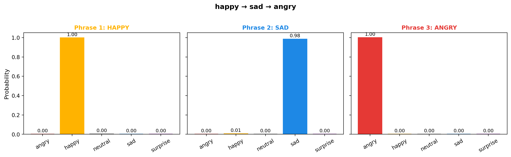
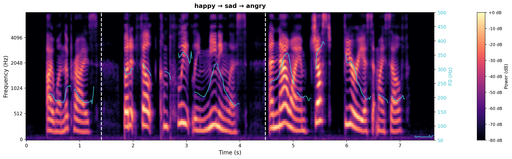
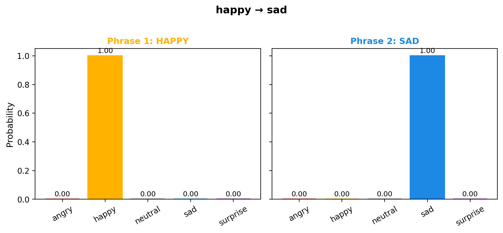
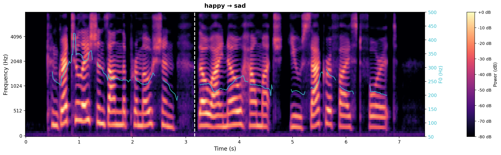
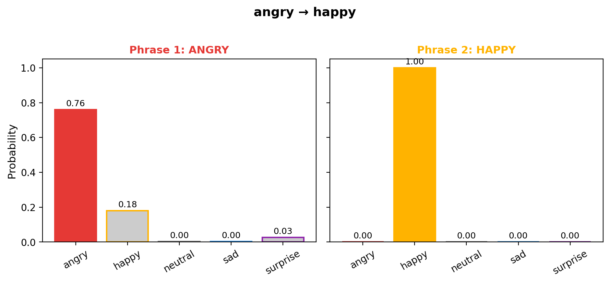
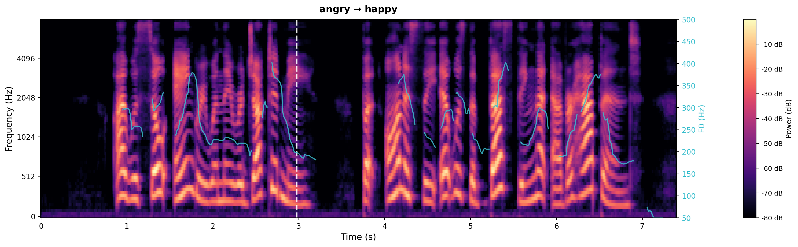

# Segment-Level Emotion Steering — Sample Results

## Sample 1 — happy → sad → angry

| Text | Emotion |
|------|---------|
| *"I won the prize, / but it felt completely meaningless, / and now I am just furious at myself."* | happy → sad → angry |

| Emotion2Vec Prediction | Mel Spectrogram + F0 |
|:---:|:---:|
|  |  |

| Phrase | Target | Detected | Score |
|--------|--------|----------|:-----:|
| "I won the prize," | happy | ✓ happy | **0.997** |
| "but it felt completely meaningless," | sad | ✓ sad | **0.984** |
| "and now I am just furious at myself." | angry | ✓ angry | **1.000** |

---

## Sample 2 — happy → sad

| Text | Emotion |
|------|---------|
| *"Congratulations on the promotion, / though I know how much you sacrificed for it."* | happy → sad |

| Emotion2Vec Prediction | Mel Spectrogram + F0 |
|:---:|:---:|
|  |  |

| Phrase | Target | Detected | Score |
|--------|--------|----------|:-----:|
| "Congratulations on the promotion," | happy | ✓ happy | **1.000** |
| "though I know how much you sacrificed for it." | sad | ✓ sad | **1.000** |

---

## Sample 3 — angry → happy

| Text | Emotion |
|------|---------|
| *"I was so angry when they rejected me, / but honestly, it was the best thing that ever happened."* | angry → happy |

| Emotion2Vec Prediction | Mel Spectrogram + F0 |
|:---:|:---:|
|  |  |

| Phrase | Target | Detected | Score |
|--------|--------|----------|:-----:|
| "I was so angry when they rejected me," | angry | ✓ angry | **0.759** |
| "but honestly, it was the best thing that ever happened." | happy | ✓ happy | **1.000** |

---

*Emotion2Vec model: `iic/emotion2vec_plus_large`. Phrase boundaries estimated by character-length ratio. White dashed lines on spectrogram mark phrase boundaries.*
